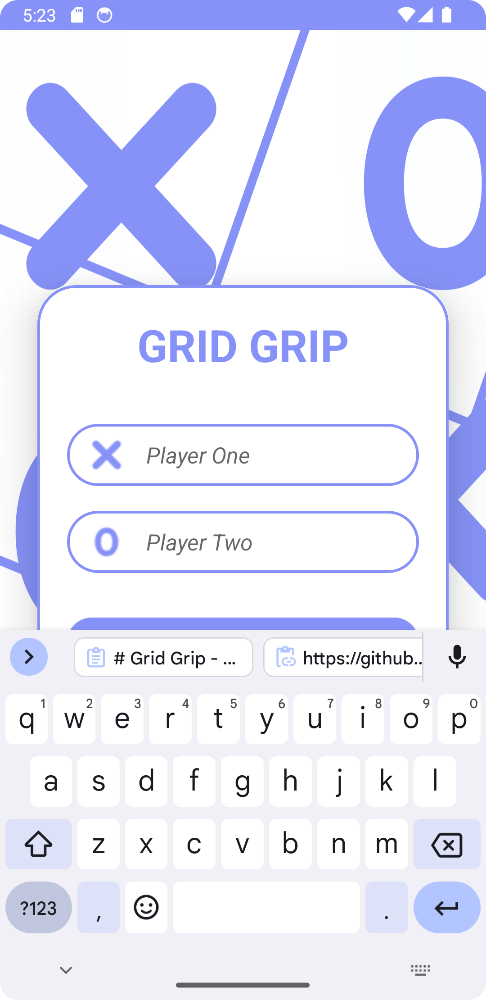
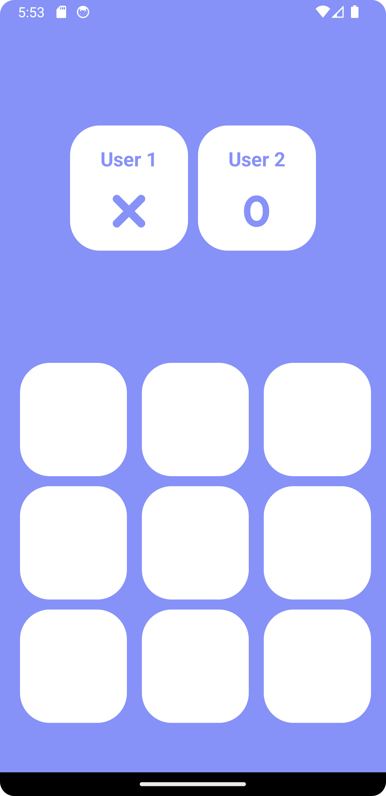
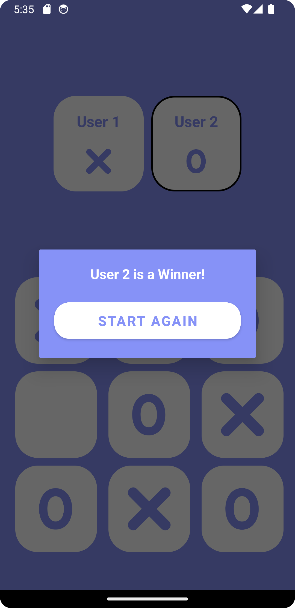

<h1> Grid Grip - Android Tic Tac Toe Game</h1>

Grid Grip is a sleek and addictive Tic Tac Toe game for Android devices. Experience classic gameplay with a modern twist!

## Features

- **Single Player Mode**: Play against an AI opponent with varying difficulty levels.
- **Multiplayer Mode**: Challenge your friends and family in a two-player game.
- **Beautiful Design**: Enjoy a sleek, modern design that enhances the gaming experience.
- **Statistics**: Track your wins, losses, and ties to monitor your progress.
- **Responsive Gameplay**: Experience smooth and responsive touch controls for seamless gameplay.

## Screenshots

    
    
    

## Download

You can download the latest version of Grid Grip from the following link:

[Grid Grip Apk](Grid_Grip.apk)

## Getting Started

To get started with Grid Grip, follow these steps:

1. Clone the repository: `git clone https://github.com/your_username/GridGrip.git`
2. Open the project in Android Studio.
3. Build and run the project on an Android device or emulator.

## Contributing

Contributions are welcome! If you find any bugs or have suggestions for improvements, please open an issue or submit a pull request. 
